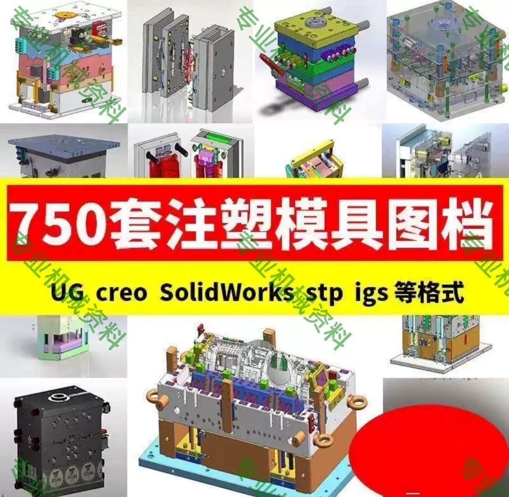
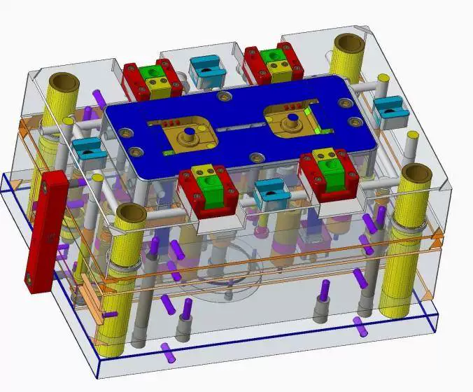
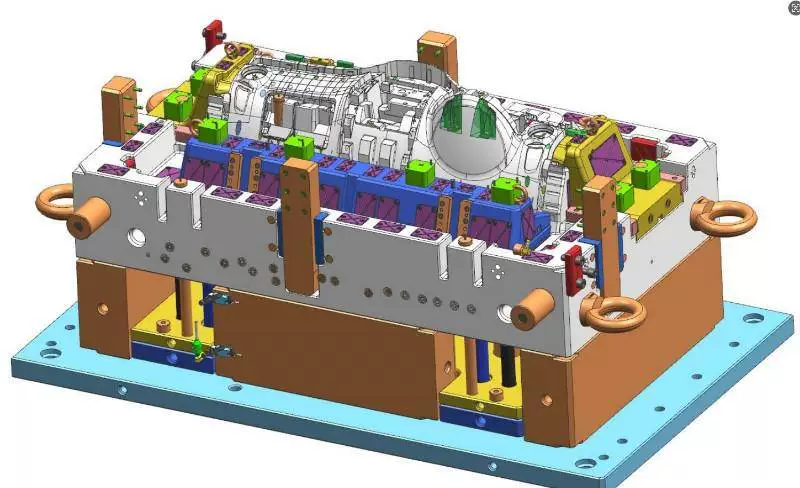
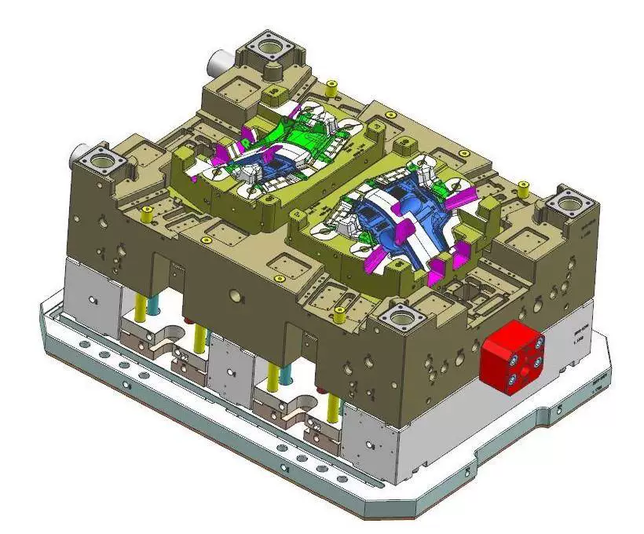
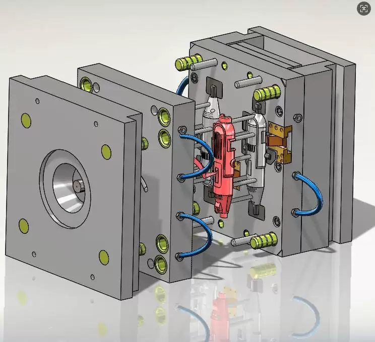
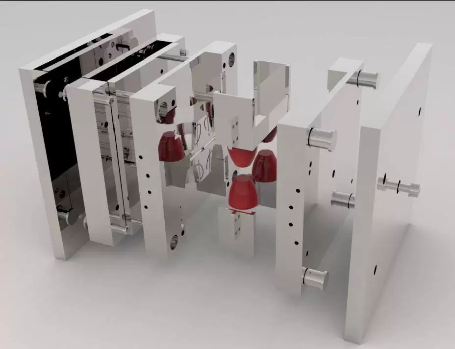
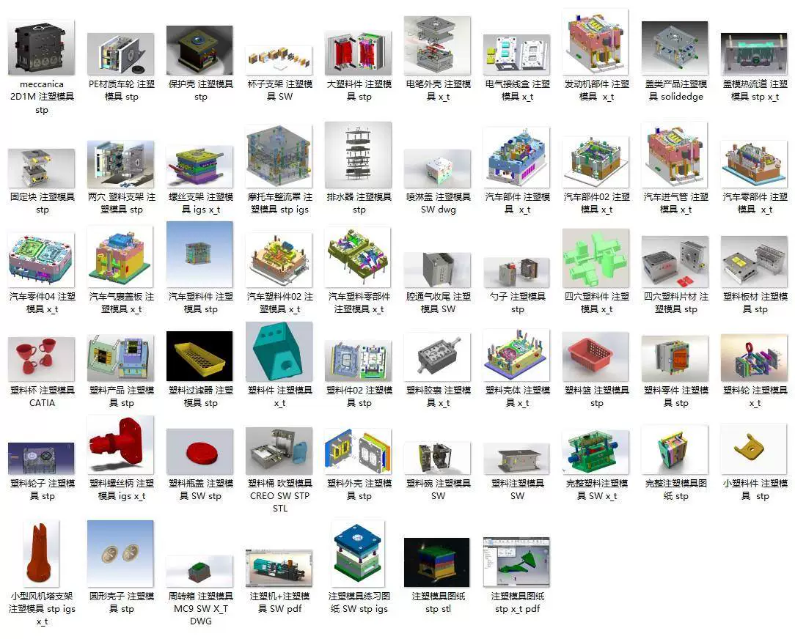

# 700 sets of injection molds 3D drawing files model 3D images 18G plastic mold design data

## Body

700 Sets of Injection Molding Mold 3D Models, 18G Plastic Mold Design Data, SW/UG/CAD
700 Sets of Injection Molding Mold 3D Models, 18G Plastic Mold Design Data, SW/UG/CAD
700 Sets of Injection Molding Mold 3D Models, 18G Plastic Mold Design Data, SW/UG/CAD

700 Sets of Injection Molding Mold 3D Models + 2D Structure Diagrams, Total 18G, SW/UG/CAD Compatible
Included in the package are STP, X_T, DWG, and other formats, covering various mold design cases such as industrial parts, daily necessities, automotive accessories, etc. Suitable for learning reference or practical application.

**Main Content:**
- Industrial Class: Fan Support, Flow Deflector, Automobile Parts, etc.
- Daily Use Class: Transparent Bin, Plastic Pot, Bottle Cap, Spoon, Chair, etc.
- Other: Wheels, Handles, Filters, Plastic Case, Spray Cover, etc.

**File Features:**
? 700 Complete Mold Drawings, directly applicable for design reference
? Include 3D models (SW/STP/X_T) and 2D structure diagrams (CAD)
? High-definition resource of 18G, clear classification, ready to use after downloading

**Auto-shipping, payment immediately after purchase, fast and convenient!**

Ideal for mold designers, mechanical engineers, students, and industry practitioners to learn and use.

## Images

## Payment

Here is a pay link on Stripe ( https://buy.stripe.com/3cs8yP7sY87d0vu9AB ). Please contact me lonlonago@foxmail.com after funding $89, and I will send you a complete data files , thank you!

